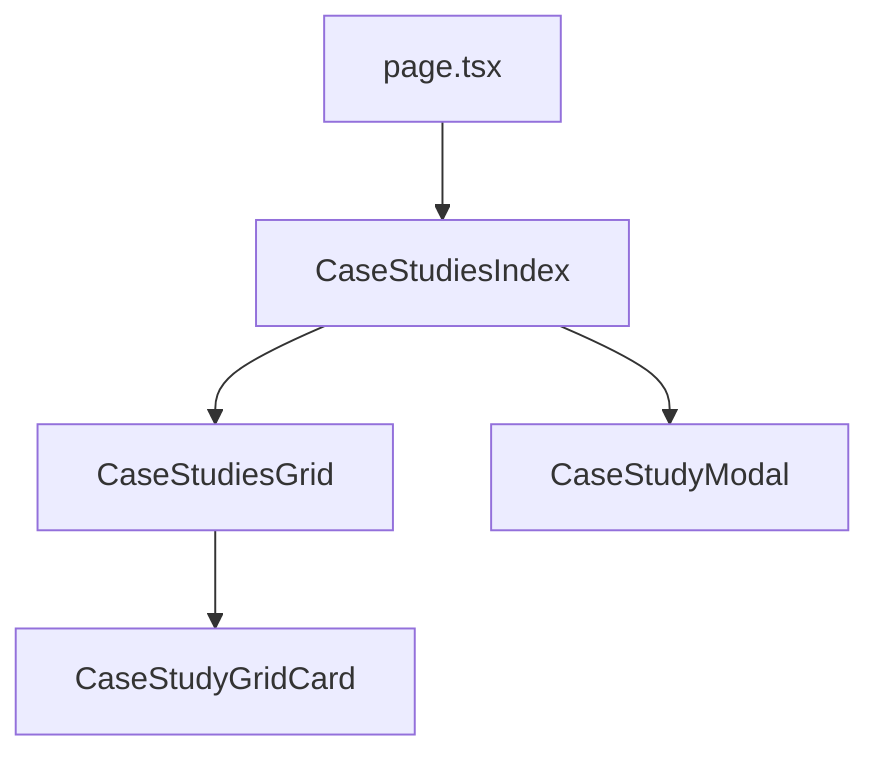

# Spec: Premium Bento Grid Case Studies Showcase

This document specifies the exact visual styling, aspect ratios, responsive layout grids, and interactive detailed modal states to implement the Case Studies grid portfolio, modeled after [Skyline's Case Studies](https://skyline.com/case-studies) but styled with B2BSA2 colors and typography.

---

## 🏗️ Architectural Breakdown

The case studies page will be structured as follows:



### 1. Card Component: `CaseStudyGridCard`
- **Path**: `src/components/cards/CaseStudyGridCard.tsx` [NEW]
- **Visual Design Spec**:
  * **Dimensions**: `w-full h-[320px] lg:h-[437px]` (locked vertical height to match Skyline's horizontal row alignment).
  * **Border Radius**: `rounded-[10px]` (exactly 10px rounding).
  * **Borders & Shadows**: Borderless design (`border-none`), no heavy shadows.
  * **Cover Image & Overlay**: The background image uses cover positioning (`object-cover`). A soft semi-transparent dark overlay (`bg-brand-charcoal/30`) covers it. A gradient layer is applied at the bottom third for text readability:
    ```tailwind
    bg-gradient-to-t from-brand-charcoal/90 via-brand-charcoal/40 to-transparent
    ```
  * **Centered Format Icon**: A circular glass outline button centered in the card (`border-2 border-white/20 h-12 w-12 bg-white/5 backdrop-blur-xs`) containing a white dynamic Lucide format icon.
  * **Metric Badge**: An absolute-positioned badge in the top right corner:
    ```tsx
    <div className="absolute top-6 right-6 z-10 rounded-2xl border border-white/10 bg-white/10 px-4 py-2.5 backdrop-blur-md transition-all duration-300 group-hover:bg-white/20 group-hover:border-white/20">
      <div className="font-heading text-lg font-bold text-white leading-none">{metric}</div>
      <div className="mt-1 text-[8px] font-bold tracking-wider text-white/80 uppercase">{metricLabel}</div>
    </div>
    ```
  * **Card Title**: Centered horizontally directly below the format icon with a small upward translation on hover (`group-hover:-translate-y-1 transition-transform duration-300`).
  * **Transitions**: Image scales smoothly on hover (`group-hover:scale-105 transition-transform duration-300 ease`).

### 2. Grid & Filter Section: `CaseStudiesGrid`
- **Path**: `src/components/sections/CaseStudiesGrid.tsx` [NEW]
- **Visual Design Spec**:
  * **Intro Spacing**: Includes a top margin block with an uppercase dark bold heading and gray body text to introduce the grid:
    ```tsx
    <div className="container mx-auto px-8 text-center max-w-4xl py-16 md:py-24">
      <h2 className="font-sans text-2xl font-bold uppercase tracking-wider text-brand-charcoal md:text-4xl leading-tight">
        DISCOVER HOW LEADING BRANDS TACKLE CHALLENGES AND ACHIEVE SCALE WITH OUR SOLUTIONS
      </h2>
      <p className="mt-6 text-base text-gray-500 font-sans leading-relaxed max-w-2xl mx-auto">
        Our results are not accidental. They are engineered through strategic rigor, creative stand design, clean data quality, and disciplined CRM integration. Take a look at our visual case study portfolio.
      </p>
    </div>
    ```
  * **Filter Pill Bar**: Semi-transparent border buttons arranged in a horizontal row. Active pill has `bg-brand-blue text-white shadow-md shadow-brand-blue/20`.
  * **Grid Layout Type**: CSS Grid (`display: grid`) base of 12 columns with an exact 14px computed gap (`grid-cols-1 md:grid-cols-2 lg:grid-cols-12 gap-[14px]`).
  * **Dynamic Rhythmic Spanning**: Spans are mathematically mapped based on index to fill rows perfectly:
    ```typescript
    const gridSpans = [
      "lg:col-span-3 md:col-span-1", // Card 1: span 3 / 12 (approx 1:2 vertical aspect)
      "lg:col-span-3 md:col-span-1", // Card 2: span 3 / 12 (approx 1:2 vertical aspect)
      "lg:col-span-6 md:col-span-2", // Card 3: span 6 / 12 (approx 1:1 square aspect)
      "lg:col-span-5 md:col-span-1", // Card 4
      "lg:col-span-4 md:col-span-1", // Card 5
      "lg:col-span-3 md:col-span-1"  // Card 6
    ];
    ```
    For our 3 current mock studies, this maps them to a **`3 + 3 + 6 = 12` column span in a single horizontal row on desktop**, aligning their vertical heights to exactly 437px with zero shifts!

### 3. Detailed Success Modal: `CaseStudyModal`
- **Path**: `src/components/sections/CaseStudyModal.tsx` [NEW]
- **Visual Design Spec**:
  * **Wrapper**: Fixed container overlay with a glassmorphic blurred backdrop (`bg-brand-charcoal/80 backdrop-blur-md`).
  * **Modal Window**: A centered grid container spanning two unequal columns on desktop:
    ```tailwind
    grid h-full max-h-[85vh] w-full max-w-6xl overflow-hidden rounded-[2.5rem] border border-white/10 bg-white shadow-2xl md:grid-cols-[1.2fr_0.8fr]
    ```
  * **Left Scrollable Content**: Contains the rich copy (Challenge, What We Did, Detailed Results) exactly from `docs/content.md`.
  * **Right Sidebar**: Background `bg-brand-gray`, showing full Event details, Location, Services Delivered, and a centered CTA button.

### 4. Page Orchestrator: `CaseStudiesIndex`
- **Path**: `src/components/sections/CaseStudiesIndex.tsx` [MODIFY]
- **Visual Design Spec**:
  * Acts as the core page orchestrator.
  * Manages active filter state and overlay modal state transitions.
  * Coordinates layout wrappers: renders `<CaseStudiesGrid />` and the overlay `<CaseStudyModal />` wrapped inside an `<AnimatePresence />`.

---

## 🛠️ Step-by-Step Implementation Files & Code Snippets

### 1. Types & Data Extensions

#### `src/types/case-studies.ts` [MODIFY]
```typescript
export interface CaseStudyCardData {
  badge?: string;
  client: string;
  href?: string;
  icon: string;
  id: string;
  image: string;
  inactiveLabel?: string;
  metric: string;
  metricLabel: string;
  primarySummary: CaseStudyCardSummary;
  secondarySummary: CaseStudyCardSummary;
  title: string;
}

export interface CaseStudyCardSummary {
  label: string;
  text: string;
}

export interface CaseStudyIndexEntry {
  anchorId: string;
  card: CaseStudyCardData;
  challenge: string;
  companySize: string;
  event: string;
  geography: string;
  id: string;
  industry: string;
  results: string;
  serviceCategories: string[];
  servicesText: string;
  title: string;
  whatWeDid: string;
  format: 'video' | 'gallery' | 'text';
  formatIcon: string;
}
```

#### `src/content/case-studies.tsx` [MODIFY]
Add formats and formatIcon mapping matching their nature:
- **Adobe Summit 2025**: `format: 'text'`, `formatIcon: 'BookOpen'`
- **Money 20/20 Europe 2025**: `format: 'gallery'`, `formatIcon: 'Camera'`
- **World Aviation Festival 2025**: `format: 'video'`, `formatIcon: 'Play'`

---

### 2. Grid Card Component

#### `src/components/cards/CaseStudyGridCard.tsx` [NEW]
```tsx
"use client";

import { motion } from "framer-motion";
import Image from "next/image";
import Icon from "@/components/ui/Icon";
import { cn } from "@/lib";

interface CaseStudyGridCardProps {
  title: string;
  image: string;
  metric: string;
  metricLabel: string;
  iconName: string;
  format: "video" | "gallery" | "text";
  colSpan: string;
  onClick: () => void;
}

export const CaseStudyGridCard = ({
  title,
  image,
  metric,
  metricLabel,
  iconName,
  format,
  colSpan,
  onClick,
}: CaseStudyGridCardProps) => {
  return (
    <motion.div
      onClick={onClick}
      className={cn(
        "group relative cursor-pointer overflow-hidden rounded-[10px] bg-brand-charcoal h-[320px] lg:h-[437px] w-full border-none",
        colSpan
      )}
      whileHover={{ y: -4 }}
      transition={{ duration: 0.3 }}
    >
      {/* Background Image scaling on Hover */}
      <div className="absolute inset-0 z-0">
        <Image
          alt={title}
          src={image}
          fill
          sizes="(max-width: 768px) 100vw, (max-width: 1024px) 50vw, 33vw"
          className="object-cover transition-transform duration-700 ease-out group-hover:scale-105"
        />
        {/* Color Muting + Gradient readability layer */}
        <div className="absolute inset-0 bg-brand-charcoal/30 transition-opacity duration-300 group-hover:bg-brand-charcoal/20" />
        <div className="absolute inset-0 bg-gradient-to-t from-brand-charcoal/90 via-brand-charcoal/40 to-transparent" />
      </div>

      {/* Top right metric badge */}
      <div className="absolute top-6 right-6 z-10 rounded-2xl border border-white/10 bg-white/10 px-4 py-2.5 backdrop-blur-md transition-all duration-300 group-hover:bg-white/20 group-hover:border-white/20">
        <div className="font-heading text-lg font-bold text-white leading-none">
          {metric}
        </div>
        <div className="mt-1 text-[8px] font-bold tracking-wider text-white/80 uppercase">
          {metricLabel}
        </div>
      </div>

      {/* Card visual elements */}
      <div className="absolute inset-0 z-10 flex flex-col items-center justify-center p-6 text-center">
        {/* Centered Outline Circle format icon */}
        <div className="flex h-12 w-12 items-center justify-center rounded-full border-2 border-white/20 bg-white/5 backdrop-blur-xs text-white transition-all duration-500 group-hover:scale-110 group-hover:border-brand-cyan/60 group-hover:bg-brand-blue/30 group-hover:shadow-[0_0_20px_rgba(75,192,217,0.4)]">
          <Icon className="h-5 w-5 text-white transition-colors duration-300 group-hover:text-brand-cyan" name={iconName} />
        </div>

        {/* Dynamic centered title */}
        <div className="mt-6 transform transition-transform duration-300 group-hover:-translate-y-1">
          <h3 className="max-w-xs font-sans text-lg font-bold leading-snug text-white md:text-xl drop-shadow-md">
            {title}
          </h3>
          <span className="mt-2 inline-flex items-center gap-1 text-[10px] font-bold tracking-widest text-brand-cyan opacity-0 transition-all duration-300 group-hover:opacity-100">
            VIEW SUCCESS STORY →
          </span>
        </div>
      </div>
    </motion.div>
  );
};
```

---

### 3. Grid Component

#### `src/components/sections/CaseStudiesGrid.tsx` [NEW]
```tsx
"use client";

import { useState } from "react";
import { CaseStudyGridCard } from "@/components/cards/CaseStudyGridCard";
import { CaseStudyIndexEntry } from "@/types/case-studies";

interface CaseStudiesGridProps {
  studies: CaseStudyIndexEntry[];
  onSelectStudy: (study: CaseStudyIndexEntry) => void;
}

export const CaseStudiesGrid = ({ studies, onSelectStudy }: CaseStudiesGridProps) => {
  const [activeFilter, setActiveFilter] = useState("All");

  const filters = ["All", "Event Lead Generation", "Custom Booth Design", "Full Event Program"];

  const filteredStudies = activeFilter === "All"
    ? studies
    : studies.filter(s => s.serviceCategories.includes(activeFilter));

  // Dynamic Bento Spans: Card 1 (3/12), Card 2 (3/12), Card 3 (6/12)
  const gridSpans = [
    "lg:col-span-3 md:col-span-1",
    "lg:col-span-3 md:col-span-1",
    "lg:col-span-6 md:col-span-2",
    "lg:col-span-5 md:col-span-1",
    "lg:col-span-4 md:col-span-1",
    "lg:col-span-3 md:col-span-1"
  ];

  return (
    <div className="w-full bg-white">
      {/* 1. Pill Filters */}
      <div className="py-8 border-y border-gray-100 bg-brand-gray/30">
        <div className="container mx-auto px-8 flex flex-wrap justify-center gap-3">
          {filters.map(filter => (
            <button
              key={filter}
              onClick={() => setActiveFilter(filter)}
              className={`rounded-full px-6 py-2.5 text-xs font-bold uppercase tracking-wider transition-all duration-300 ${
                activeFilter === filter
                  ? "bg-brand-blue text-white shadow-md shadow-brand-blue/20"
                  : "bg-white border border-gray-200 text-gray-600 hover:border-brand-blue hover:text-brand-blue"
              }`}
            >
              {filter}
            </button>
          ))}
        </div>
      </div>

      {/* 2. Asymmetric Bento Grid (Cols 12, Gap 14px) */}
      <div className="py-16 md:py-24">
        <div className="container mx-auto px-8 max-w-7xl">
          <div className="grid gap-[14px] sm:grid-cols-2 lg:grid-cols-12">
            {filteredStudies.map((study, index) => (
              <CaseStudyGridCard
                key={study.id}
                title={study.card.client}
                image={study.card.image}
                metric={study.card.metric}
                metricLabel={study.card.metricLabel}
                iconName={study.formatIcon}
                format={study.format}
                colSpan={gridSpans[index % gridSpans.length]}
                onClick={() => onSelectStudy(study)}
              />
            ))}
          </div>
        </div>
      </div>
    </div>
  );
};
```

---

### 4. Detailed Modal Component

#### `src/components/sections/CaseStudyModal.tsx` [NEW]
```tsx
"use client";

import { motion } from "framer-motion";
import { X, MapPin, Layers } from "lucide-react";
import Image from "next/image";
import { Button } from "@/components/ui/Button";
import { CaseStudyIndexEntry } from "@/types/case-studies";

interface CaseStudyModalProps {
  isOpen: boolean;
  onClose: () => void;
  study: CaseStudyIndexEntry;
}

export const CaseStudyModal = ({ isOpen, onClose, study }: CaseStudyModalProps) => {
  if (!isOpen || !study) return null;

  return (
    <div className="fixed inset-0 z-[100] flex items-center justify-center p-4 md:p-10">
      {/* Backdrop blur overlay */}
      <motion.div
        initial={{ opacity: 0 }}
        animate={{ opacity: 1 }}
        exit={{ opacity: 0 }}
        onClick={onClose}
        className="absolute inset-0 bg-brand-charcoal/80 backdrop-blur-md"
      />

      {/* Slide-Up container modal */}
      <motion.div
        initial={{ opacity: 0, y: 60, scale: 0.98 }}
        animate={{ opacity: 1, y: 0, scale: 1 }}
        exit={{ opacity: 0, y: 60, scale: 0.98 }}
        transition={{ duration: 0.45, ease: [0.16, 1, 0.3, 1] }}
        className="relative z-10 grid h-full max-h-[85vh] w-full max-w-6xl overflow-hidden rounded-[2.5rem] border border-white/10 bg-white shadow-2xl md:grid-cols-[1.2fr_0.8fr]"
      >
        {/* Top absolute Close Button */}
        <button
          onClick={onClose}
          className="absolute top-6 right-6 z-50 flex h-10 w-10 items-center justify-center rounded-full border border-gray-100 bg-white text-gray-500 hover:text-black transition-colors"
        >
          <X className="h-5 w-5" />
        </button>

        {/* Scrollable details wrapper */}
        <div className="overflow-y-auto p-8 md:p-14">
          <span className="text-xs font-bold tracking-widest text-brand-blue uppercase">
            {study.industry}
          </span>
          <h2 className="mt-4 font-heading text-3xl font-bold text-brand-charcoal md:text-5xl leading-tight">
            {study.title}
          </h2>

          <div className="mt-10 space-y-8 pr-4">
            <div>
              <h4 className="text-xs font-bold tracking-wider text-brand-blue uppercase">
                The Challenge
              </h4>
              <p className="mt-3 text-base leading-relaxed text-gray-600 font-sans">
                {study.challenge}
              </p>
            </div>

            <div>
              <h4 className="text-xs font-bold tracking-wider text-brand-blue uppercase">
                What We Did
              </h4>
              <p className="mt-3 text-base leading-relaxed text-gray-600 font-sans">
                {study.whatWeDid}
              </p>
            </div>

            <div>
              <h4 className="text-xs font-bold tracking-wider text-brand-blue uppercase">
                Detailed Results
              </h4>
              <p className="mt-3 text-base leading-relaxed text-gray-600 font-sans">
                {study.results}
              </p>
            </div>
          </div>
        </div>

        {/* Sidebar Details Panel */}
        <div className="relative hidden flex-col justify-between bg-brand-gray p-8 md:flex md:p-12 border-l border-gray-100">
          <div className="relative aspect-video w-full overflow-hidden rounded-2xl border border-gray-200 shadow-sm">
            <Image
              alt={study.title}
              src={study.card.image}
              fill
              className="object-cover"
            />
          </div>

          <div className="my-8 space-y-5">
            <div className="flex items-center gap-4">
              <div className="flex h-10 w-10 items-center justify-center rounded-full bg-brand-blue/10 text-brand-blue">
                <MapPin className="h-5 w-5" />
              </div>
              <div>
                <div className="text-[10px] font-bold text-gray-400 uppercase tracking-wider">Event & Location</div>
                <div className="text-sm font-semibold text-brand-charcoal">{study.event}</div>
              </div>
            </div>

            <div className="flex items-center gap-4">
              <div className="flex h-10 w-10 items-center justify-center rounded-full bg-brand-blue/10 text-brand-blue">
                <Layers className="h-5 w-5" />
              </div>
              <div>
                <div className="text-[10px] font-bold text-gray-400 uppercase tracking-wider">Services Delivered</div>
                <div className="text-sm font-semibold text-brand-charcoal">{study.servicesText}</div>
              </div>
            </div>
          </div>

          {/* Core Impact highlights */}
          <div className="rounded-2xl border border-brand-blue/10 bg-brand-blue/5 p-6 text-center">
            <div className="text-sm font-bold text-brand-blue uppercase tracking-widest">
              Impact Delivered
            </div>
            <div className="mt-2 font-heading text-4xl font-bold text-brand-blue">
              {study.card.metric}
            </div>
            <div className="mt-1 text-xs font-medium text-gray-500">
              {study.card.metricLabel}
            </div>
          </div>

          <div className="mt-8">
            <Button className="w-full justify-center shadow-lg" variant="primary">
              Book a Strategy Session
            </Button>
          </div>
        </div>
      </motion.div>
    </div>
  );
};
```

---

### 5. Index Shell

#### `src/components/sections/CaseStudiesIndex.tsx` [MODIFY]
```tsx
"use client";

import { useState } from "react";
import { AnimatePresence } from "framer-motion";
import { CaseStudiesGrid } from "./CaseStudiesGrid";
import { CaseStudyModal } from "./CaseStudyModal";
import { CASE_STUDIES_PAGE_STUDIES } from "@/content/case-studies";
import { CaseStudyIndexEntry } from "@/types/case-studies";

export const CaseStudiesIndex = () => {
  const [selectedStudy, setSelectedStudy] = useState<CaseStudyIndexEntry | null>(null);

  return (
    <main className="min-h-screen bg-white pt-24">
      {/* Typographic Intro Title Section */}
      <section className="bg-white py-16 md:py-24">
        <div className="container mx-auto px-8 text-center max-w-4xl">
          <h1 className="font-sans text-2xl font-bold uppercase tracking-wider text-brand-charcoal md:text-4xl leading-tight">
            DISCOVER HOW LEADING BRANDS TACKLE CHALLENGES AND ACHIEVE SCALE WITH OUR SOLUTIONS
          </h1>
          <p className="mt-6 text-base text-gray-500 font-sans leading-relaxed max-w-2xl mx-auto">
            Our results are not accidental. They are engineered through strategic rigor, creative stand design, clean data quality, and disciplined CRM integration. Take a look at our visual case study portfolio.
          </p>
        </div>
      </section>

      {/* Bento Grid layout section */}
      <CaseStudiesGrid
        studies={CASE_STUDIES_PAGE_STUDIES as CaseStudyIndexEntry[]}
        onSelectStudy={setSelectedStudy}
      />

      {/* Slide-Up success modals overlay */}
      <AnimatePresence>
        {selectedStudy && (
          <CaseStudyModal
            isOpen={!!selectedStudy}
            onClose={() => setSelectedStudy(null)}
            study={selectedStudy}
          />
        )}
      </AnimatePresence>
    </main>
  );
};
```
