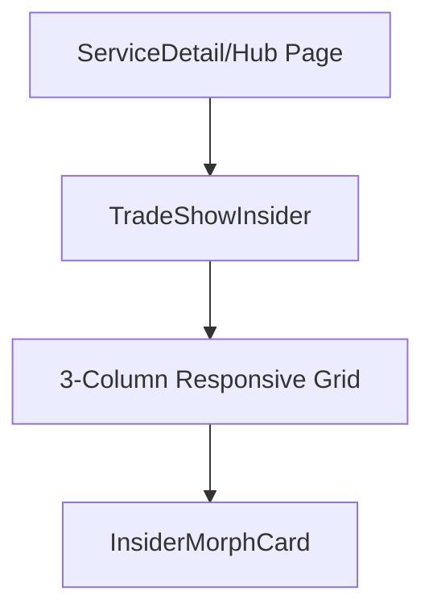

# Spec: Trade Show Insider Insights Showcase (Homepage Morphing Cards)

This document specifies the exact visual styling, DOM layout, and interactive color-morphing transition properties to implement the **"Trade Show Insider"** card section, modeled after the homepage section of [Skyline](https://skyline.com/) but styled in alignment with B2BSA2 design standards.

---

## 🏗️ Architectural Breakdown

The section will be implemented as a reusable component that can be easily rendered on the Home page, Service hubs, or detail routes:



### 1. Card Component: `InsiderMorphCard`
- **Path**: `src/components/cards/InsiderMorphCard.tsx` [NEW]
- **Exact Skyline Mechanical Spec**:
  * **Morphing Interaction**: 
    - **Default State**: Displays a standard blog card with a thumbnail image wrapper on top (`h-[238px]`) and a light neutral text background below (`bg-brand-gray` or `bg-neutral-100`).
    - **Hovered State**: The thumbnail image wrapper height expands smoothly from `238px` to `100%` (covering the full height of the card!). Simultaneously, a rich solid overlay fades in on top of the image (`opacity: 100`), and all text colors transition from black (`text-neutral-900`) to pure white (`text-white`).
  * **Visual Stability (Zero-Shift Typography)**:
    To prevent any visual jumping, text scaling, or layout shifting, the typography coordinates remain absolutely static. Only the background elements morph and fade underneath the copy.
  * **The "3D Title" Effect (GPU Hardware Acceleration)**:
    To keep the heavy geometric text perfectly sharp and avoid blurry font rendering or sub-pixel jitter during browser transitions, we trigger GPU-composited layers on the absolute overlay and text nodes using `transform-style: preserve-3d;` and `will-change: transform`.

### 2. Spacing & Aspect Sizing Chart

| Property | Default State Sizing | Hovered State Sizing | Transition Styling |
| :--- | :--- | :--- | :--- |
| **Card Base** | `h-[450px] bg-neutral-100 rounded-[10px]` | `h-[450px] bg-brand-blue` | `transition-all duration-500 ease` |
| **Image Wrapper** | `h-[238px] relative overflow-hidden` | `h-full absolute inset-0` | `transition-all duration-700 ease-in-out` |
| **Solid Overlay** | `opacity-0 bg-brand-blue/95 absolute inset-0` | `opacity-100` | `transition-opacity duration-500 ease` |
| **Metadata Text** | `text-neutral-500 uppercase text-xs` | `text-white/80` | `transition-colors duration-400 ease` |
| **H3 Title Text** | `text-neutral-900 text-xl font-extrabold` | `text-white` | `transition-colors duration-400 ease` |
| **CTA Arrow** | `translate-x-0 text-neutral-900 text-sm` | `translate-x-1.5 text-white` | `transition-transform duration-300 ease` |

---

## 🛠️ Step-by-Step Implementation Snippets

### 1. The Morphing Card Component

#### `src/components/cards/InsiderMorphCard.tsx` [NEW]
```tsx
"use client";

import { motion } from "framer-motion";
import { ArrowRight } from "lucide-react";
import Image from "next/image";
import Link from "next/link";
import { cn } from "@/lib";

interface InsiderMorphCardProps {
  id: string;
  category: string;
  author: string;
  date: string;
  title: string;
  image: string;
  href: string;
  overlayColor?: string; // Optional custom solid hover color
}

export const InsiderMorphCard = ({
  category,
  author,
  date,
  title,
  image,
  href,
  overlayColor = "bg-brand-blue/95", // Custom B2BSA2 brand-blue overlay
}: InsiderMorphCardProps) => {
  return (
    <Link
      href={href}
      className="group relative block h-[450px] w-full overflow-hidden rounded-[10px] bg-neutral-100 transition-colors duration-500 hover:bg-brand-blue focus-visible:outline-none focus-visible:ring-2 focus-visible:ring-brand-blue"
    >
      {/* 1. Dynamic morphing image wrapper */}
      <div className="absolute top-0 left-0 right-0 h-[238px] overflow-hidden transition-all duration-700 ease-in-out group-hover:h-full z-10">
        <Image
          alt={title}
          src={image}
          fill
          sizes="(max-width: 768px) 100vw, 400px"
          className="object-cover"
        />
        {/* Solid hardware-accelerated overlay */}
        <div
          className={cn(
            "absolute inset-0 opacity-0 transition-opacity duration-500 ease-in-out group-hover:opacity-100 z-10 pointer-events-none transform-style-3d",
            overlayColor
          )}
        />
      </div>

      {/* 2. Absolute Static Text Overlay (Zero-Shift structure) */}
      <div className="absolute inset-0 p-6 md:p-8 flex flex-col justify-between z-20 pointer-events-none">
        {/* Top spacer matching default image height */}
        <div className="h-[214px] flex-shrink-0" />

        {/* Text content container */}
        <div className="flex flex-col flex-1 justify-between pt-6">
          <div>
            {/* Author & Date metadata */}
            <div className="flex items-center gap-2 text-xs font-semibold text-neutral-500 group-hover:text-white/80 uppercase tracking-wider mb-3 transition-colors duration-400 transform-style-3d">
              <span>{author}</span>
              <span>|</span>
              <span>{date}</span>
            </div>
            
            {/* 3D-Composited Title */}
            <h3 className="font-sans text-xl font-extrabold leading-tight tracking-tight text-neutral-900 group-hover:text-white transition-colors duration-400 mb-4 transform-style-3d line-clamp-3">
              {title}
            </h3>
          </div>

          {/* Action Link CTA */}
          <div className="flex items-center gap-2 text-sm font-bold text-neutral-900 group-hover:text-white uppercase tracking-wide transition-colors duration-400 transform-style-3d">
            <span>Start Reading</span>
            <ArrowRight className="h-4 w-4 transition-transform duration-300 group-hover:translate-x-1.5" />
          </div>
        </div>
      </div>
    </Link>
  );
};
```

---

### 2. The Trade Show Insider Section Component

#### `src/components/sections/TradeShowInsider.tsx` [NEW]
```tsx
"use client";

import { motion } from "framer-motion";
import { InsiderMorphCard } from "@/components/cards/InsiderMorphCard";

export interface InsiderArticle {
  id: string;
  category: string;
  author: string;
  date: string;
  title: string;
  image: string;
  href: string;
}

interface TradeShowInsiderProps {
  eyebrow?: string;
  heading?: string;
  subtext?: string;
  articles?: InsiderArticle[];
}

const DEFAULT_ARTICLES: InsiderArticle[] = [
  {
    id: "tip-1",
    category: "Strategic Planning",
    author: "Growth Architect",
    date: "May 14, 2026",
    title: "Make the Most of Every Trade Show: Strategic Planning for Exhibition Success",
    image: "https://images.unsplash.com/photo-1540575467063-178a50c2df87?auto=format&fit=crop&q=80&w=800",
    href: "/blogs/strategic-planning-for-exhibition-success",
  },
  {
    id: "tip-2",
    category: "Lead Capture",
    author: "B2B Sales Arrow Team",
    date: "May 07, 2026",
    title: "Double Your BANT Leads: The Ultimate Guide to In-Booth Prospect Engagement",
    image: "https://images.unsplash.com/photo-1551818255-e6e10975bc17?auto=format&fit=crop&q=80&w=800",
    href: "/blogs/guide-to-in-booth-prospect-engagement",
  },
  {
    id: "tip-3",
    category: "Booth Design",
    author: "Design Lead",
    date: "April 29, 2026",
    title: "Visual Architecture: How Immersive Booth Experiences Turn Bystanders Into Buyers",
    image: "https://images.unsplash.com/photo-1460925895917-afdab827c52f?auto=format&fit=crop&q=80&w=800",
    href: "/blogs/booth-experiences-turn-bystanders-into-buyers",
  },
];

export const TradeShowInsider = ({
  eyebrow = "Trade Show Insider",
  heading = "Expert Trade Show Tips & Strategies",
  subtext = "Stay ahead with our actionable insights, expert tips and industry trends.",
  articles = DEFAULT_ARTICLES,
}: TradeShowInsiderProps) => {
  return (
    <section className="bg-white py-20 border-t border-gray-100" id="trade-show-insider">
      <div className="container mx-auto px-8 max-w-7xl">
        {/* Left-Aligned Header Block */}
        <div className="mb-12 max-w-3xl text-left">
          <span className="text-xs font-bold tracking-widest text-brand-blue uppercase">
            {eyebrow}
          </span>
          <h2 className="mt-3 font-sans text-3xl font-extrabold leading-tight tracking-tight text-neutral-900 md:text-4xl uppercase">
            {heading}
          </h2>
          <p className="mt-4 text-base text-gray-500 font-sans leading-relaxed">
            {subtext}
          </p>
        </div>

        {/* 3-Column Morphing Cards Grid */}
        <div className="grid gap-6 sm:grid-cols-2 lg:grid-cols-3">
          {articles.map((article) => (
            <InsiderMorphCard
              key={article.id}
              id={article.id}
              category={article.category}
              author={article.author}
              date={article.date}
              title={article.title}
              image={article.image}
              href={article.href}
            />
          ))}
        </div>
      </div>
    </section>
  );
};
```

---

## ⚡ CSS Hardware Acceleration Layer

To prevent any font rendering issues or text blurring during relative element height transitions, we append this visual helper directly inside B2BSA2's CSS config:

```css
@utility transform-style-3d {
  transform-style: preserve-3d;
  will-change: transform;
  backface-visibility: hidden;
}
```
This forces browser GPU compositing on text nodes, ensuring buttery-smooth transitions and a pristine visual finish.
